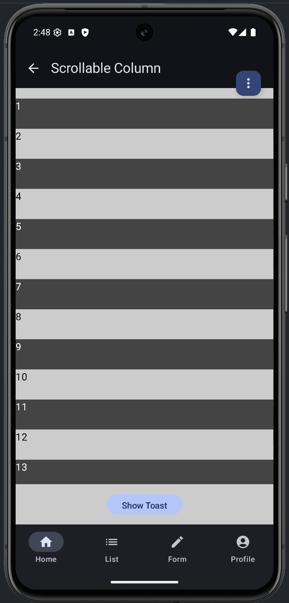
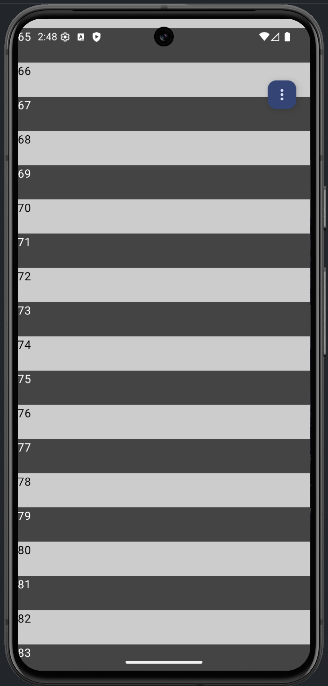
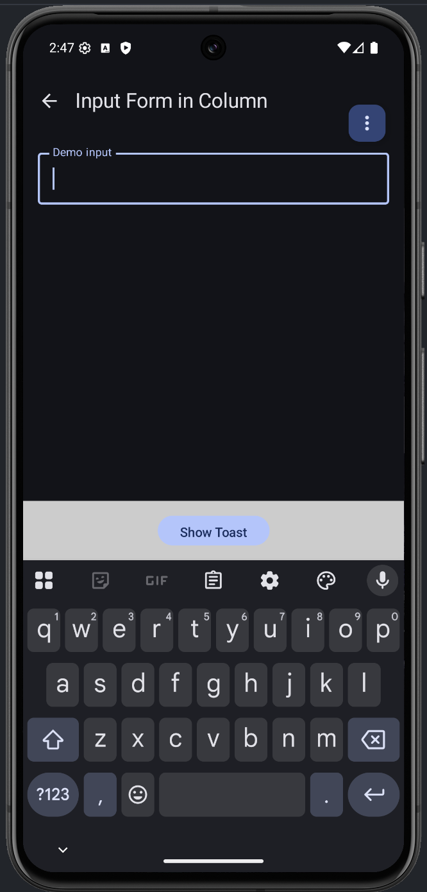
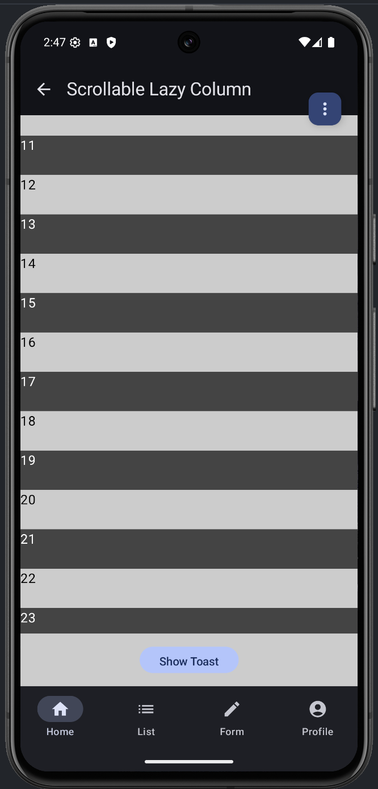

## ScreenContentScaffold

`screen-scaffold` is a small Compose SDK module that provides
`ScreenContentScaffold`, a reusable screen container for apps that need optional
top content, sticky bottom content, scrollable body content, and sensible system
bar/IME padding behavior.

<div style="display: flex; gap: 12px; overflow-x: auto; padding-bottom: 8px;">
  
  
  
  
</div>

## Deployment Status

[](https://central.sonatype.com/artifact/com.ostraszynski/screen-scaffold)

- Status: published to Maven Central
- Package: [`com.ostraszynski:screen-scaffold`](https://central.sonatype.com/artifact/com.ostraszynski/screen-scaffold)
- Latest version: shown in the Maven Central badge above
- License: [Apache License 2.0](LICENSE.md)

Add the dependency with:

```kotlin
implementation("com.ostraszynski:screen-scaffold:<latest-version>")
```

## Usage

The scaffold supports:

- optional headers
- optional footers
- transparent sticky footers, with content allowed behind the footer
- regular `Column` content
- `LazyColumn` content
- custom content padding
- screens that use a bottom tab/navigation bar instead of a scaffold footer
- optional Material3 top app bar scroll behavior wiring

Import the composable:

```kotlin
import com.ostraszynski.screen_scaffold.ScreenContentScaffold
```

Use regular `Column` content with optional header and footer slots:

```kotlin
@Composable
fun DetailsScreen() {
    ScreenContentScaffold(
        header = {
            ...
        },
        footer = {
            ...
        },
        content = {
            ...
        },
    )
}
```

Use lazy content when the body is list-based:

```kotlin
@Composable
fun FeedScreen(items: List<FeedItem>) {
    ScreenContentScaffold(
        lazyColumnContent = {
            items(items) { item ->
                ...
            }
        },
    )
}
```

Pass your own scroll state when another part of the screen needs to observe or
control scrolling:

```kotlin
@Composable
fun ScrollAwareScreen() {
    val scrollState = rememberScrollState()

    ScreenContentScaffold(
        scrollState = scrollState,
        content = {
            ...
        },
    )
}
```

Use a `LazyListState` with lazy content:

```kotlin
@Composable
fun StatefulFeedScreen(items: List<FeedItem>) {
    val listState = rememberLazyListState()

    ScreenContentScaffold(
        listState = listState,
        lazyColumnContent = {
            items(items) { item ->
                ...
            }
        },
    )
}
```

Wire Material3 top app bar scroll behavior through the scaffold:

```kotlin
@OptIn(ExperimentalMaterial3Api::class)
@Composable
fun CollapsingHeaderScreen() {
    val scrollBehavior = TopAppBarDefaults.exitUntilCollapsedScrollBehavior()

    ScreenContentScaffold(
        scrollBehavior = scrollBehavior,
        header = {
            LargeTopAppBar(
                title = {
                    ...
                },
                scrollBehavior = scrollBehavior,
            )
        },
        content = {
            ...
        },
    )
}
```

Add custom body padding, account for a separate bottom tab/navigation bar, or
apply IME padding at scaffold level:

```kotlin
@Composable
fun FormScreen() {
    ScreenContentScaffold(
        contentPadding = PaddingValues(16.dp),
        tabNavigationBarShown = true,
        applyImePadding = true,
        content = {
            ...
        },
    )
}
```

Adjust column alignment and arrangement for non-list layouts:

```kotlin
@Composable
fun EmptyStateScreen() {
    ScreenContentScaffold(
        verticalArrangement = Arrangement.Center,
        horizontalAlignment = Alignment.CenterHorizontally,
        content = {
            ...
        },
    )
}
```

## Testing

Testing documentation is available in [TESTING.md](TESTING.md) for maintainers.

## License

Screen Scaffold is available under the [Apache License 2.0](LICENSE.md).
